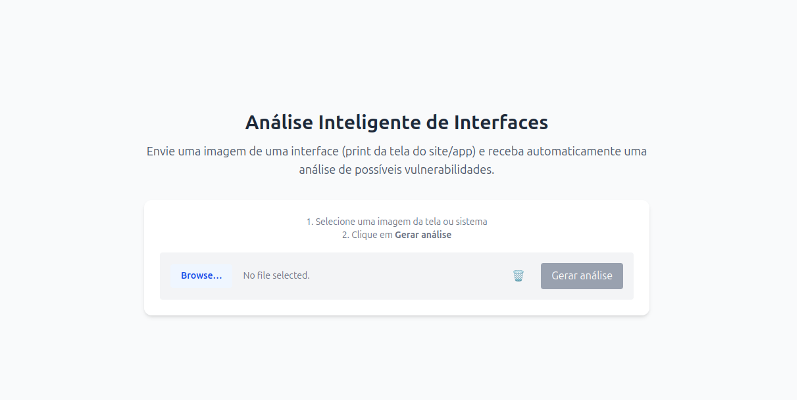
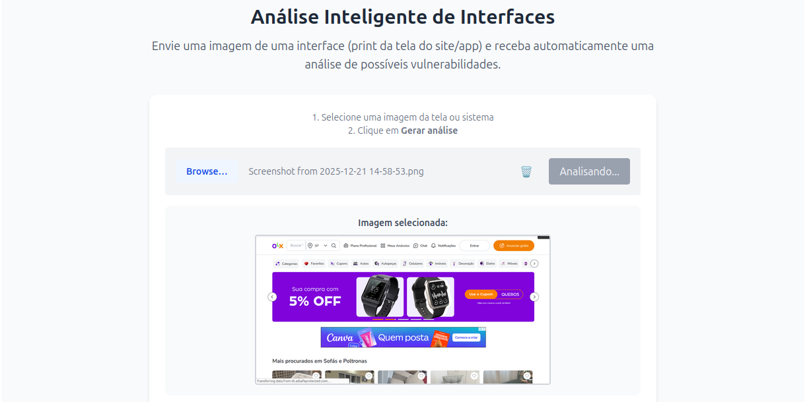
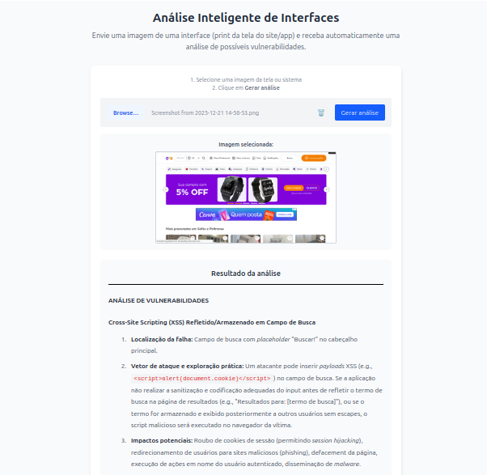

# An-lise-Inteligente-de-Interfaces

## Conceito do projeto
Com a rápida expansão das ferramentas de IA no desenvolvimento de software, a segurança muitas vezes é deixada em segundo plano. Este projeto visa auxiliar usuários, especialmente os menos técnicos, a identificar vulnerabilidades em suas aplicações. A partir de um print da tela, a ferramenta analisa possíveis brechas, oferece explicações detalhadas e gera testes específicos para validar a existência dessas falhas.
  
## Pré-requisitos e recursos utilizados

### Backend
O backend foi desenvolvido com o framework NestJS utilizando a linguagem TypeScript. A integração com inteligência artificial foi realizada através do SDK oficial do Google para o Gemini ([`@google/genai`](https://www.npmjs.com/package/@google/genai))

### Frontend
O frontend foi desenvolvido com React e Vite, utilizando também a linguagem TypeScript. Para a renderização das respostas da IA, utilizou-se a biblioteca [`marked`](https://www.npmjs.com/package/marked), permitindo a exibição de conteúdo em formato Markdown.
  
## Passo a passo

1. **Criação do backend**
   - 1.1 Construção da rota de análise
     - 1.1.1 Criação do endpoint de análise
     - 1.1.1 Criação do prompt de descrição da imagem
     - 1.1.2 Criação do prompt de análise de possíveis vulnerabilidades
     - 1.1.3 Integração com o Gemini
2. **Criação do frontend**
   - 2.1 Construção da tela principal
      - 2.1.1 Upload de arquivo
      - 2.1.2 Mostrar análise em Markdown
   - 2.2 Integração com o backend

## Instalação e Execução

> **Pré-requisito:** Certifique-se de ter o [Node.js](https://nodejs.org/en/download/current) instalado.

### Backend

1. Clone o repositório:
```bash
git clone https://github.com/FelipeBonadia/An-lise-Inteligente-de-Interfaces.git
```

2. Entre na pasta do backend:
```bash
cd backend
```

3. Instale as dependências:
```bash
npm install
```

4. Crie um arquivo `.env` na raiz da pasta `backend`, com base no arquivo `.env-example`:
```env
GEMINI_API_KEY=sua_chave_api_do_gemini
FRONTEND_URL=url_do_frontend
```

5. Execute o backend:
```bash
nest start
```

O backend estará rodando em `http://localhost:3000`

---

### Frontend

6. Abra um novo terminal na raiz do projeto, e entre na pasta do frontend:
```bash
cd frontend
```

7. Instale as dependências:
```bash
npm install
```

8. Crie um arquivo `.env` na raiz da pasta `frontend`, com base no arquivo `.env-example`:
```env
VITE_BACKEND_URL=url_do_backend
```

9. Execute o frontend:
```bash
npm run dev
```

O frontend estará disponível em `http://localhost:5173`

## Bugs/problemas conhecidos
Como utilizamos integração com modelos de linguagem (LLM), ressaltamos que podem ocorrer erros ou inconsistências nas respostas. Esta é uma ferramenta de auxílio e suporte, não devendo ser considerada uma fonte de verdade única ou absoluta.

## Autores
 * Felipe Bonadia de Oliveira Bravo
 * Luis Felipi Cruz de Souza

## Imagens/screenshots
### Tela inicial


### Escolha da interface


### Backend em execução


### Resultado



